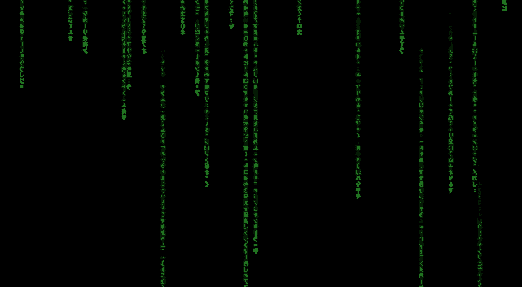

  

<!-- ### Hey, I'm Kos, a beginning back-end developer from Kz.
My last job as an audit-company staff made me think of studying coding, and now I'm in here trying to eventually become some good developer to be able to make a change .. maybe, we'll see.
You can browse around my repositories all you like, have fun.
Have a good coding!

And now, ... wake up -->

<!--
**Kosmohs/Kosmohs** is a ✨ _special_ ✨ repository because its `README.md` (this file) appears on your GitHub profile.

Here are some ideas to get you started:

- 🔭 I’m currently working on ...
- 🌱 I’m currently learning ...
- 👯 I’m looking to collaborate on ...
- 🤔 I’m looking for help with ...
- 💬 Ask me about ...
- 📫 How to reach me: ...
- 😄 Pronouns: ...
- ⚡ Fun fact: ...
-->
